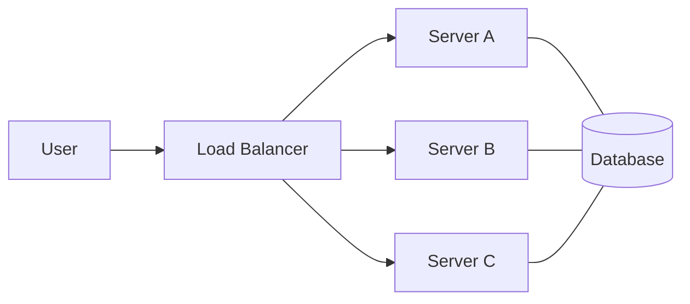

# Load Balancers (LB)

Load balancers are the "Entry Point" of any horizontally scaled system.

## Concept
They distribute incoming network traffic across a group of backend servers.

## Algorithms
1. **Round Robin**: Sequential distribution. Simple but doesn't account for server load.
2. **Least Connections**: Sends requests to the server with the fewest active connections.
3. **IP Hash**: Uses IP address to determine the server (useful for session stickiness).

## Layers
- **L4 (Transport Layer)**: Based on IP and Port. Faster, but doesn't look at content.
- **L7 (Application Layer)**: Based on HTTP content (URL, Cookies, Headers). More intelligent routing.

## Interview Tip
When asked about scalability, **always** mention where the Load Balancer sits and how it prevents a single server from being overwhelmed.
