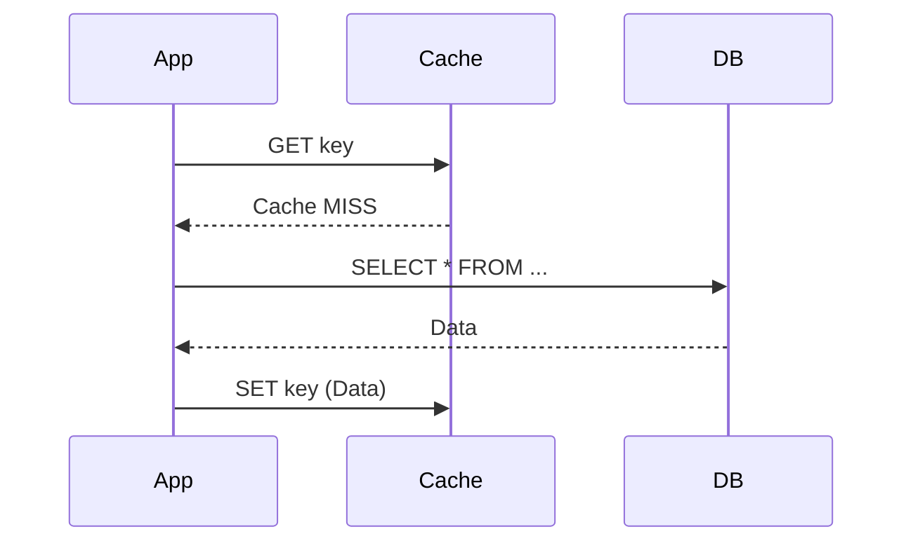

# Redis Caching Deep Dive: Scaling for High Concurrency

Redis is the de-facto standard for distributed caching. In high-concurrency systems (like TikTok or Meta), Redis isn't just "faster storage"—it's a critical reliability layer.

## 1. Why is Redis so fast?
In an interview, explain these three factors:
1. **In-Memory Storage**: Data resides in RAM, avoiding disk I/O latency.
2. **Optimized Data Structures**: Hand-crafted structures like `SkipList`, `ZipList`, and `IntSet` minimize memory and maximize speed.
3. **Single-Threaded I/O Multiplexing**: Redis uses a single thread to handle requests via `epoll`, avoiding CPU context switching and lock contention (though modern Redis uses helper threads for background tasks).

---

## 2. Caching Patterns

### Cache-Aside (Most Common)
The application handles the interaction with the cache and database.

### Write-Behind (High Performance)
Write to cache immediately, and a background task updates the DB later.
- **Pros**: Extreme write performance.
- **Cons**: Risk of data loss if Redis crashes before the DB is updated.

---

## 3. The 3 High-Concurrency Disasters

In a system with millions of QPS, these three problems can take down your entire infrastructure.

### 1. Cache Avalanche (缓存雪崩)
**Problem**: A massive number of keys expire at the same time, or the Redis cluster goes down. Millions of requests hit the DB simultaneously.
- **Solution**: 
  - **Random TTL**: Add a random jitter (e.g., 1-5 mins) to expiration times so they don't expire together.
  - **High Availability**: Use Redis Cluster or Sentinel to ensure no single point of failure.

### 2. Cache Breakdown / Hotspot Key (缓存击穿)
**Problem**: A single "hot" key (e.g., a viral video) expires. Thousands of threads try to rebuild the cache at once.
- **Solution**:
  - **Mutex Lock**: Only the first thread gets a lock to update the cache; others wait or retry.
  - **Logical Expiration**: Don't set a physical TTL in Redis. Store an `expire_at` field in the data. If expired, return stale data but trigger an async background update.

### 3. Cache Penetration (缓存穿透)
**Problem**: Requesting keys that don't exist in either the cache or the DB (e.g., a query for `user_id: -99`).
- **Solution**:
  - **Cache Nulls**: Store a dummy/empty value for non-existent keys with a short TTL.
  - **Bloom Filter**: Use a bit-array to quickly check if a key *might* exist before hitting the DB.

---

## 4. Scaling Redis for 1B Users

### Master-Slave Replication
- One Master handles writes, multiple Slaves handle reads.
- Provides **Read Scalability**.

### Redis Sentinel
- Monitors the Master and automatically triggers a failover if it dies.
- Provides **High Availability**.

### Redis Cluster (Sharding)
- Distributes data across multiple Master nodes using **Hash Slots (16384 total)**.
- Provides **Write Scalability** and **Massive Storage**.

---

## 5. Caching Best Practices
- **Small Payloads**: Keep values small. Use Protobuf instead of large JSON strings if possible.
- **Avoid Big Keys**: A single key with 10,000 hash fields can cause blocking during deletion or eviction.
- **Monitoring**: Watch the `MaxMemory` usage and `Evicted_Keys` metric closely.
