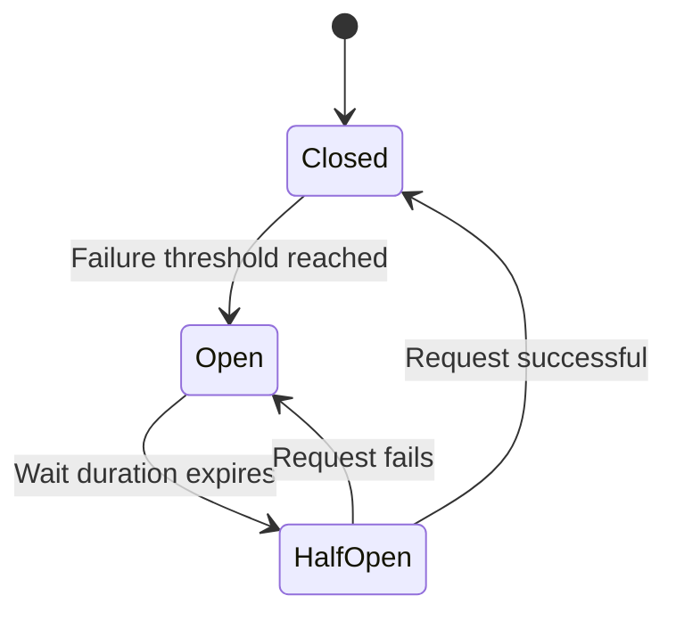

# System Resiliency Patterns

Stability patterns are essential to prevent a single service failure from cascading into a global system crash. These are the core pillars of **High Availability**.

## 1. Rate Limiting (限流)
Protect your service from being overwhelmed by too many requests (DDoS, noisy neighbors, or crawler spikes).

### Common Algorithms
- **Token Bucket**: Allows for bursts, maintains a steady average rate.
- **Leaky Bucket**: Forces a constant processing rate, regardless of arrival rate.
- **Fixed/Sliding Window**: Simple to implement but can be less smooth during window transitions.

### Implementation Levels
- **API Gateway**: Front-line defense.
- **Distributed Limiter**: Using Redis (LUA scripts) for consistent limiting across a cluster.

---

## 2. Circuit Breaking (熔断)
Prevents a caller from repeatedly hitting a failing dependency, allowing the dependency time to recover.

### Circuit Breaker States

- **Closed**: Requests pass through. Failures are tracked.
- **Open**: Requests fail immediately without hitting the downstream service.
- **Half-Open**: A limited number of test requests are allowed to see if the service has recovered.

---

## 3. Service Degradation (降级)
Consciously sacrificing non-critical features to ensure core functionality remains available.

- **Example**: If the "Recommendation Service" is slow, the "News Feed" can fall back to a chronological list or cached results instead of crashing.
- **Types**:
  - **Automatic**: Triggered by a circuit breaker or timeout.
  - **Manual**: Triggered during extreme traffic (e.g., black friday sale).
- **Fallbacks**: Return default values, empty lists, or data from a "stale" cache.

---

## 4. Timeout (超时)
Enforcing a strict time limit on every network call to prevent "Thread Exhaustion."

- **The Problem**: If Service A calls Service B and B hangs, Service A's threads will fill up waiting for B, eventually crashing Service A too.
- **Best Practices**:
  - **Fail Fast**: Set conservative timeouts (e.g., 200ms for internal RPC).
  - **Retries with Exponential Backoff**: Only retry on transient failures (5xx), never on client errors (4xx).
  - **Jitter**: Add a small random delay to retries to avoid "Thundering Herd" spikes.

---

## 5. Summary Table

| Pattern | Goal | Implementation |
|---------|------|----------------|
| **Rate Limiting** | Protect Backend | Gateway / Redis |
| **Circuit Breaking** | Stop Cascading Failure | Client-side Interceptor |
| **Degradation** | System Survival | Fallback Logic |
| **Timeout** | Release Resources | RPC / HTTP Client |
