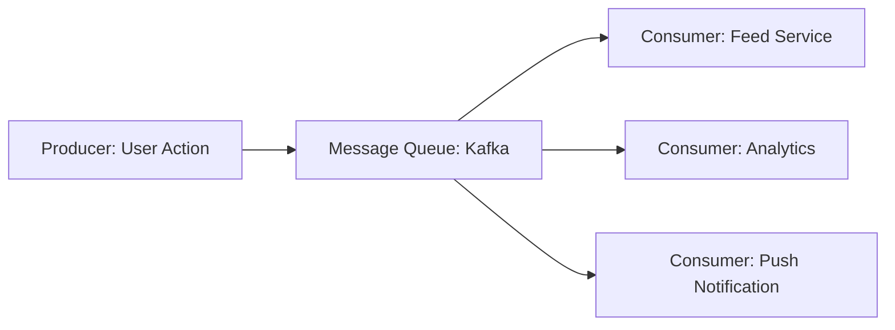

# Architectural Patterns

## 1. Monolithic vs Microservices
- **Monolith**: Single codebase, easy to test/deploy at small scale. Hard to scale as team grows.
- **Microservices**: Decomposed into small, independent services.
  - *Pros*: Scaling individual parts, polyglot (different tech stacks), independent deployments.
  - *Cons*: Network latency, data consistency (Sagas), operational complexity.

## 2. Event-Driven Architecture (EDA)
Instead of service-to-service synchronous calls (REST), use an asynchronous message queue.

- **Benefits**: Decoupling, fan-out (one message to many consumers), throughput handling.
- **Tools**: Apache Kafka, RabbitMQ, Amazon SQS.

## 3. Publisher-Subscriber (Pub/Sub)
Standard pattern for real-time updates and notification systems.

## 4. API Gateway
A single entry point for all clients. Handles:
- Authentication / Authorization
- Rate Limiting
- Request Routing
- Logging
