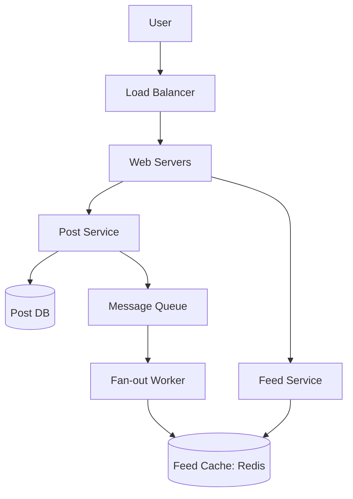

# Case Study: Design a News Feed (Meta/TikTok)

## 1. Problem Statement
- **Goal**: Design a service where users can see posts from friends and followed pages.
- **Users**: 1B Total, 500M Daily Active (DAU).
- **Scale**: Heavy read (pulling feed), spikes in writes (massive events).

## 2. Requirements
- **Functional**: Post creation, Feed viewing (timeline), Following users.
- **Non-Functional**: Low latency (< 200ms), High availability, Eventual consistency (okay if a post shows up 10s late).

## 3. High-Level Design (Fan-out)

## 4. Key Concepts: Pull vs Push
- **Pull (Fan-out on load)**: Feed is generated when user refreshes. Good for users with many followers (Celebrities).
- **Push (Fan-out on write)**: When a user posts, it's pushed to all followers' caches. Fast reads, but slow writes for celebrities ("Celebrity Problem").
- **Hybrid Approach**: Push for normal users, Pull for celebrities.

## 5. Components
- **Post Service**: Stores text/media metadata.
- **Media Storage**: S3 for images/videos + CDN.
- **Feed Cache**: Redis clusters storing `PostIDs` for each user.

## 6. Optimization
- **Pagination**: Use cursor-based pagination for smooth scrolling.
- **Ranking**: Use a separate Ranking Service (ML based) to sort posts.
