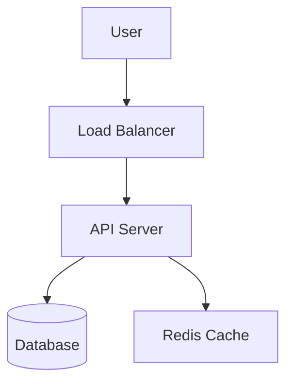

# Case Study Template: [Problem Name]

## 1. Problem Statement
- **Goal**: [e.g., Design a URL Shortening service like TinyURL]
- **Users**: [e.g., 100M daily active users]
- **Key Features**:
  - [Feature 1]
  - [Feature 2]

## 2. Requirements & Constraints
### Functional Requirements
- [x] Requirement A
- [x] Requirement B

### Non-Functional Requirements
- [ ] Scalability (Handle X requests/sec)
- [ ] Availability (High availability vs Consistency)
- [ ] Latency (Sub-100ms response)

### Capacity Estimation (Back-of-the-envelope)
- **Traffic**: [Calculation]
- **Storage**: [Calculation]
- **Bandwidth**: [Calculation]

## 3. High-Level Design


## 4. API Design
### [Endpoint 1: e.g. GET /v1/resource]
- **Description**: [What it does]
- **Request Parameters**:
  - `param1`: [Type, Description]
- **Response**:
  ```json
  {
    "id": "123",
    "status": "ok"
  }
  ```

### [Endpoint 2: e.g. POST /v1/resource]
- **Description**: [What it does]
- **Payload**: [JSON structure]

## 5. Component Deep Dive
### [Component A: e.g. Database Schema]
- Choice of DB: [SQL vs NoSQL]
- Schema details:

### [Component B: e.g. Key Generation]
- Algorithm:
- Pros/Cons:

## 6. Scaling & Bottlenecks
- How to handle [X bottleneck]?
- Monitoring and Metrics.

## 7. Summary / Trade-offs
- [Trade-off 1]
- [Trade-off 2]

---

### Reference Links
- [API Design Core Concepts](../06-API-Design/api-design-overview.md)
- [REST vs GraphQL vs gRPC](../06-API-Design/01-rest-api.md)
