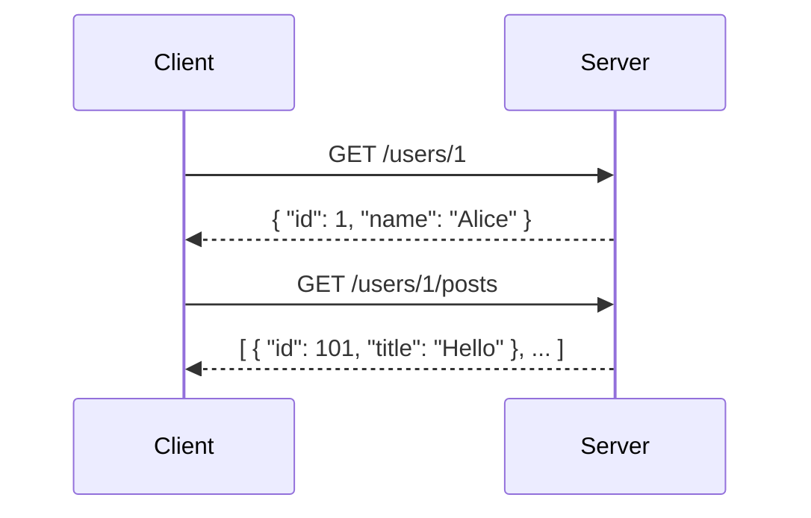
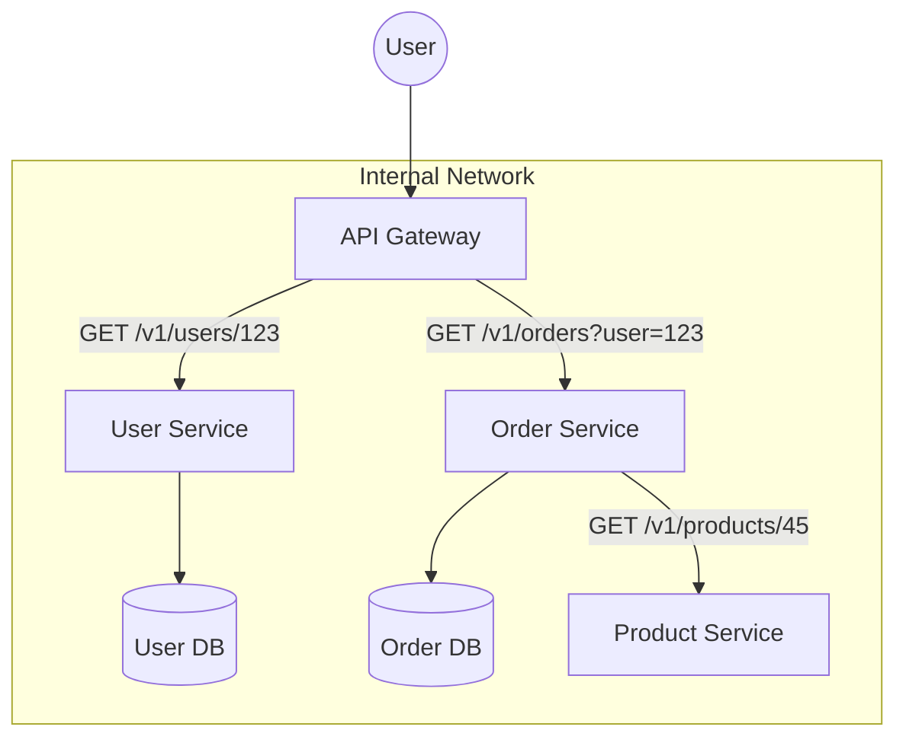

# REST API Deep Dive

REST (Representational State Transfer) is the most common architectural style for networked applications. However, "doing REST" correctly is often misunderstood in interviews.

## 1. Richardson Maturity Model
To evaluate how "RESTful" an API is, we use this model:
- **Level 0: Swamp of POX**: One URI, one HTTP method (usually POST) for everything (e.g., SOAP).
- **Level 1: Resources**: Individual URIs for different resources, but still one method.
- **Level 2: HTTP Verbs**: Proper use of GET, POST, PUT, DELETE.
- **Level 3: Hypermedia Controls (HATEOAS)**: The API response provides links to related actions.

## 2. Resource Modeling & URI Design
- **Nouns, not Verbs**: Use `/users`, not `/getUsers`.
- **Plurals**: `/users/123/posts`, not `/user/123/post`.
- **Hierarchical Relationships**: `/authors/45/books`.
- **Query Parameters for Filtering/Sorting**: `/users?role=admin&sort=created_at`.

### REST Efficiency Issues

#### Issue 1: Under-fetching (Multiple Round-trips)
In REST, resources are isolated. To get a user and their posts, you often need two requests.



#### Issue 2: Over-fetching (Excess Data)
The server defines the response structure. You get all fields even if you only need the "name".

```mermaid
graph LR
    Client -- "GET /users/1" --> Server
    Server -- "{ id, name, email, age, bio, avatar, ... }" --> Client
    Note over Client: Only needed 'name'
```

### REST in Microservices Architecture
In a microservices world, REST is often used for communication between the API Gateway and internal services, or between services themselves.



**Key Points in this Scenario:**
- **Decoupling**: Each service can be developed and scaled independently.
- **Contract-Based**: Services agree on JSON/REST contracts.
- **Chattiness**: If an operation requires data from 5 services, the "chattiness" of REST can lead to performance bottlenecks (latency amplification).

---

## 3. HTTP Methods & Idempotency

| Method | Idempotent | Safe | Description |
|--------|------------|------|-------------|
| GET    | Yes        | Yes  | Retrieve resource. |
| POST   | No         | No   | Create new resource. |
| PUT    | Yes        | No   | Replace existing resource. |
| PATCH  | No/Yes     | No   | Partial update. |
| DELETE | Yes        | No   | Remove resource. |

## 4. Caching & Performance
- **ETags**: A unique identifier for a version of a resource. Server returns 304 Not Modified if ETag matches.
- **Cache-Control**: `max-age`, `public`, `private`, `no-cache`.
- **Last-Modified**: Timestamp-based validation.

## 5. Advanced REST Topics
- **HATEOAS**: Why use it? It decouples the client from URI structures. Why avoid it? Complex for clients and increases payload size.
- **Bulk Operations**: How to handle `POST /users` with 1000 users? (Async processing vs Bulk payload).
- **JSON Patch (RFC 6902)**: Formal way to handle partial updates.

---

## Next Steps
- [**GraphQL Deep Dive**](./02-graphql.md)
- [**gRPC & RPC Deep Dive**](./03-grpc-rpc.md)
