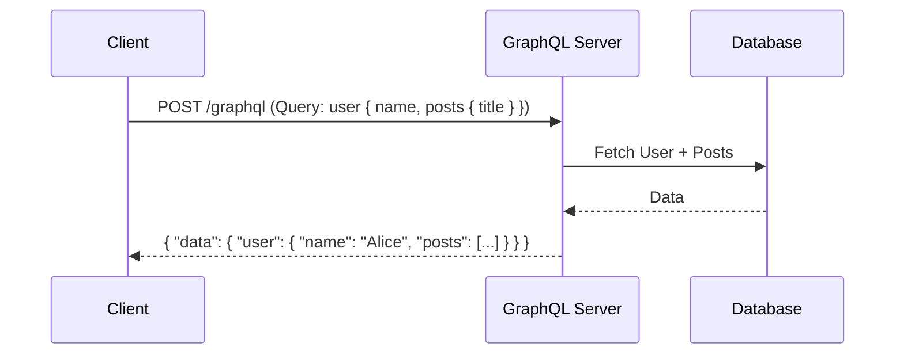

# GraphQL Deep Dive

GraphQL is a query language for APIs and a runtime for fulfilling those queries with your existing data. It solves many flexibility issues inherent in REST.

## 1. Core Concepts
- **Schema**: The blueprint of your data (Types, Queries, Mutations, Subscriptions).
- **Resolver**: The function that fetches the data for a specific field.
- **Query**: Client-specified request for data.
- **Mutation**: Request to change data.
- **Subscription**: Real-time push updates (usually over WebSockets).

### GraphQL Efficiency

#### Single Query for Multiple Resources
Unlike REST, GraphQL allows fetching a user and their posts in one round-trip.



#### Client-Side Field Selection
The client specifies exactly which fields it needs, eliminating over-fetching.

```mermaid
graph TD
    Client -- "Query: { user { name } }" --> GS[GraphQL Server]
    GS -- "{ 'name': 'Alice' }" --> Client
    Note over GS: Only 'name' is fetched and returned
```

---

## 2. Solving the N+1 Problem
In REST, you might hit `/posts` then hit `/users/{id}` for each post author (N+1 requests).
In GraphQL, if not handled correctly, the server-side will hit the DB N+1 times.
- **Solution: DataLoader**: A utility to batch and cache requests. Instead of N queries, it sends one `WHERE id IN (...)` query.

## 3. Security Considerations
- **Query Depth Limiting**: Prevent malicious users from sending deeply nested queries that crash the server.
- **Query Cost Analysis**: Assign "points" to fields and reject queries exceeding a total cost threshold.
- **Timeout**: Enforce strict execution time for resolvers.
- **No Introspection in Production**: Disable the ability to query the schema itself in prod.

## 4. GraphQL vs REST

| Feature | GraphQL | REST |
|---------|---------|------|
| Over-fetching | Zero (client picks fields) | Common (fixed response) |
| Under-fetching | Low (one request for many resources) | Common (multiple round-trips) |
| Caching | Difficult (Post-based, single endpoint) | Easy (URI-based, HTTP native) |
| Learning Curve | High (Schema, Tools) | Low (Standard HTTP) |

## 5. When to use GraphQL?
- Complex data with many relationships (Social Graphs).
- Multiple client types (Mobile, Web) needing different data shapes.
- Aggregating data from multiple microservices into a single gateway.

---

## Next Steps
- [**gRPC & RPC Deep Dive**](./03-grpc-rpc.md)
- [**Advanced Patterns**](./04-advanced-patterns.md)
