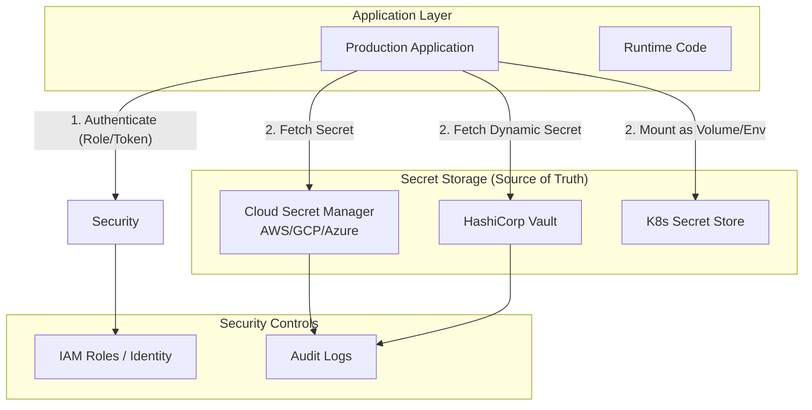

# Production Secret Management

In production environments, a "secret leak" is one of the most severe security incidents (S0 level). Effective secret management ensures that sensitive information like database passwords, API keys, and certificates are handled securely, audited, and rotated automatically.

## Architecture Overview

Secret management typically involves a secure storage (Source of Truth) and a mechanism for the application to retrieve these secrets securely at runtime.

---

## 1. Cloud-Native Managed Services
This is the standard approach for teams running on AWS, Google Cloud, or Azure.

### AWS Secrets Manager / GCP Secret Manager
*   **How it works**: Secrets are stored in a managed "vault" provided by the cloud vendor.
*   **Logic**: No hardcoded credentials. The application environment is assigned an **IAM Role**. At runtime, the application uses the Cloud SDK to fetch the secret using a unique ID (UID).
*   **Key Advantage**: **Auto Rotation**. Supports Lambda functions to automatically change passwords (e.g., every 30 days) without any code changes.

## 2. Centralized Vault Systems
Preferred by large enterprises or companies with high security/multi-cloud requirements. **HashiCorp Vault** is the industry leader.

### HashiCorp Vault
*   **How it works**: A dedicated Vault cluster is maintained.
*   **Logic**: Upon startup, the application authenticates with Vault (via Token, Kubernetes Auth, or TLS Certificate). Vault provides a **Dynamic Secret**—a temporary password with a short Time-to-Live (TTL).
*   **Key Advantage**: **Ephemeral Credentials**. Even if a secret is stolen, it will expire within hours automatically.

## 3. Kubernetes (K8s) Secrets
Standard for containerized environments.

### K8s Native Secrets
*   **How it works**: Secrets are stored as Base64 encoded strings in the K8s etcd.
*   **Logic**: Secrets are "mounted" into the application container as a file (e.g., `/etc/secrets/db_pass`) or injected as environment variables.
*   **Key Advantage**: **Infrastructure Isolation**. Limits the scope of secrets to specific namespaces and pods.

## 4. CI/CD & Automation (Ansible Vault)
Common for traditional VM-based deployments or configuration management.

### Ansible Vault
*   **How it works**: Sensitive variables in the codebase are encrypted using a "Master Key".
*   **Logic**: The encrypted file is committed to Git. During deployment, the CI/CD pipeline uses the master key to decrypt the values and push them to the target server.
*   **Key Advantage**: **GitOps Friendly**. Secrets are versioned along with the code (in encrypted form).

---

## Summary and Comparison

| Strategy | Primary Use Case | Complexity | Main Pro |
| :--- | :--- | :--- | :--- |
| **Cloud Native** | AWS/GCP Users | Medium | Built-in Auto-rotation |
| **HashiCorp Vault** | Large Enterprise | High | Dynamic/Ephemeral Secrets |
| **K8s Secrets** | Docker/K8s Apps | Low | Native integration |
| **Ansible Vault** | VM/Legacy | Low | Version control compatibility |

## Best Practices

1.  **Never commit plain text**: Not even to private repos.
2.  **Least Privilege**: Apps should only have access to the specific secrets they need.
3.  **Auditing**: Enable logs to see *who* accessed *which* secret and *when*.
4.  **Rotation**: Regularly change passwords to minimize the window of vulnerability.
