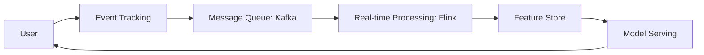

# Scaling Architecture to a Billion Users

Scaling a system like TikTok, Meta, or YouTube to a billion daily active users (DAU) requires moving beyond standard "web app" scaling into **Global Distributed Systems Architecture**.

## 1. Global Infrastructure: The Edge First Approach
At 1B users, the speed of light becomes your primary bottleneck.

### GSLB & Anycast
- **Anycast DNS**: Routes users to the nearest "Point of Presence" (PoP) using BGP routing.
- **Global Server Load Balancing (GSLB)**: Dynamically directs traffic based on region health and load.

### Edge Computing & CDNs
- **Static Content**: Images/Videos must be cached at the edge (CDN) to ensure <100ms first-byte latency.
- **Dynamic Content**: Use **Edge Workers** to handle logic like authentication or AB testing closer to the user to reduce round-trips to the "Origin" region.

---

## 2. Storage at Scale: The "Partition Everything" Rule
A single database cluster cannot handle 1B users. You must use **Horizontal Sharding**.

### Sharding Strategies
- **User-based Sharding**: Data for `User_A` is always on `Shard_1`. 
  - *Challenge*: The "Celebrity Problem" (Hot Shards).
- **Functional Sharding**: Separate services for Feed, Identity, and Chat.
- **Database Choice**: 
  - **NoSQL (KV/Wide-Column)**: Cassandra/DynamoDB for write-heavy data like Likes or View counts.
  - **NewSQL**: CockroachDB/TiDB for ACID transactions at global scale.

### Tiered Storage (The Hot/Cold Split)
- **Hot Data**: Last 24 hours of activities (Stored in Redis/In-Memory).
- **Warm Data**: Last 30 days (Stored in SSD-backed Distributed DB).
- **Cold Data**: History older than 30 days (Stored in cheap Object Storage like S3/GCS).

---

## 3. The Recommendation Pipeline: Real-time ML
TikTok's success is its "For You" feed. This requires a high-performance data pipeline.

- **Feature Engineering**: Transforming raw clicks/views into user preferences in milliseconds.
- **In-Memory Graph DBs**: Used to map "Friend of Friend" or "Common Interests" relationships.

---

## 4. Media Processing & Delivery
Video is the heaviest part of the infrastructure.

### Asynchronous Transcoding
- When a video is uploaded, it's pushed to a **transcoding queue**.
- Multiple versions (1080p, 720p, 480p) are generated for different network conditions (**Adaptive Bitrate Streaming**).
- **Protocols**: Use **QUIC (HTTP/3)** to reduce buffering in poor network conditions (e.g., traveling on a train).

---

## 5. Reliability: Cell-Based Architecture
To prevent a "Global Outage," giant systems are broken into **Cells**.

- **Isolations**: Each cell is a mini-deployment of the entire system (e.g., "Cell US-East-1A").
- **Blast Radius**: If a migration fails in Cell A, only 1% of users are affected, not the whole world.
- **Chaos Engineering**: Constantly "killing" random services in production to ensure the system is self-healing.

---

## 6. Asynchronous Architecture: The Role of Message Queues
At billion-user scale, synchronous communication is a recipe for cascading failure.

### Buffering & Load Leveling
- **Traffic Spikes**: During major events (New Year, Super Bowl), MQ (Kafka/Pulsar) acts as a buffer, preventing downstream databases from being overwhelmed.
- **Improved Responsiveness**: The user receives a "Success" as soon as the message is in the queue, rather than waiting for slow background tasks (e.g., notification fan-out).

### Decoupling & Eventual Consistency
- **Write-Heavy Flows**: Operations like "Likes" or "Follows" are written to a fast log (MQ) and processed by multiple consumers (Update stats, Notify user, ML Training).

---

## 7. Intelligent Middleware: Control & Observability
Middleware is the "Glue" that manages communication at scale.

### API Gateways
- **Unified Entry Point**: Handles AuthN, Rate Limiting, and Request Transformation.
- **Dynamic Routing**: Can route traffic to different cells or regions based on user ID or location.

### Service Mesh (Sidecar Pattern)
- **mTLS**: Automates encryption between thousands of microservices.
- **Circuit Breaking**: Automatically cuts off calls to a failing service to prevent system-wide latency.

---

## 8. Interview "Deep Dive" Questions
Be prepared to explain:
- **How do you handle a celebrity with 100M followers posting?** (Hybrid Push/Pull).
- **How do you handle clock drift in global regions?** (TrueTime or Logical Clocks).
- **What happens if a whole region goes offline?** (Failover protocols).
