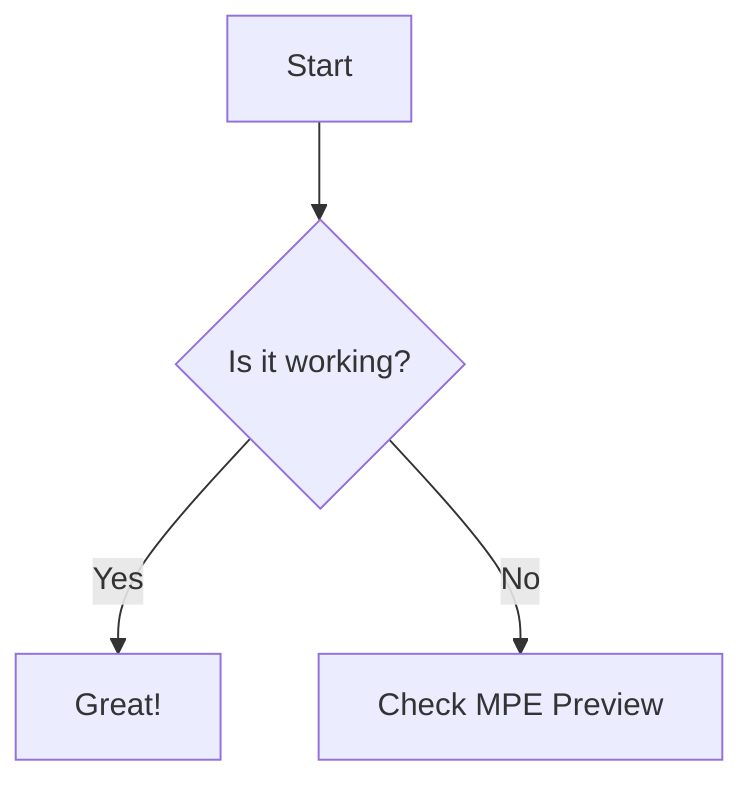
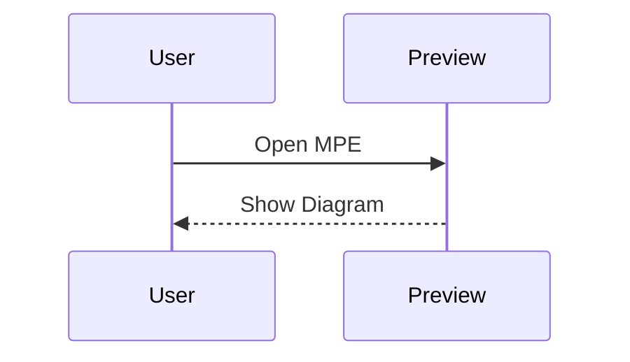
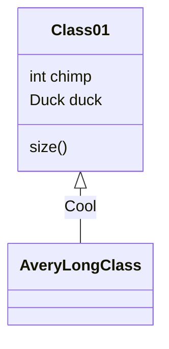

# Mermaid Test Page

If you can see the diagrams below, the plugin is working correctly.

## 1. Simple Flowchart

```mermaid
graph TD
    A[Start] --> B{Is it working?}
    B -- Yes --> C[Great!]
    B -- No --> D[Check MPE Preview]
```

## 2. Sequence Diagram

```mermaid
sequenceDiagram
    User->>Preview: Open MPE
    Preview-->>User: Show Diagram
```

## 3. Class Diagram

```mermaid
classDiagram
    Class01 <|-- AveryLongClass : Cool
    Class01 : size()
    Class01 : int chimp
    Class01 : Duck duck
```
